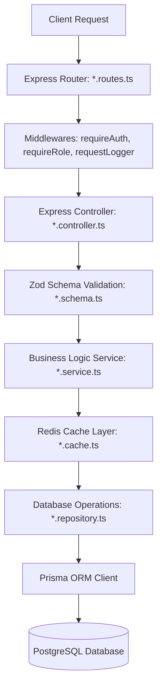

# CBS Ecommerce Server - Architecture & Codebase Map

This document provides a comprehensive mapping of the **CBS Ecommerce Server** codebase. It covers the overall directory structure, request flow, database schema, module implementation status, configuration dependencies, and key architecture guidelines.

---

## Directory Structure

```
server/
├── .env                  # Environment secrets & local config
├── Dockerfile            # Container configuration
├── package.json          # Node dependencies & run scripts
├── prisma/
│   ├── schema.prisma     # Database models & relationships
│   └── migrations/       # SQL migration history
├── tsconfig.json         # TypeScript configuration
└── src/
    ├── app.ts            # Express application initialization & middleware routing
    ├── index.ts          # Server entry point, DB/Redis health-checks & graceful shutdown
    ├── config/           # App settings validation & Redis client config
    ├── generated/        # Auto-generated Prisma client
    ├── lib/              # Clients & library initializers (Prisma, Cloudinary, Winston)
    ├── middlewares/      # Core Express middlewares (Auth, rate limit, logging, error handling)
    ├── modules/          # Business logic domains (Users, Products, Brands, etc.)
    ├── services/         # Shared utility services (Email, Storage Providers)
    ├── utils/            # Helper utility modules & custom Error classes
    └── types/            # TypeScript type declarations & definitions
```

---

## Layered Architecture (Request Flow)

The codebase utilizes a clean, layered modular architecture. For each domain (module), the request travels through the following layers:



### Layer Responsibilities
1. **Routing Layer (`*.routes.ts`)**: Defines endpoints, HTTP methods, and attaches route-specific middlewares (such as authentication or upload boundaries).
2. **Controller Layer (`*.controller.ts`)**: Processes incoming HTTP requests, handles parameter extracting, validates payload shapes via schemas, invokes services, and sends JSON responses.
3. **Zod Validation Schema (`*.schema.ts`)**: Defines strict Zod runtime schemas to parse request bodies, queries, and path parameters, exporting TypeScript types inferred from the schemas.
4. **Service Layer (`*.service.ts`)**: Coordinates core business logic (e.g. S3 file uploads, transactional computations, and cache lifecycle updates).
5. **Cache Layer (`*.cache.ts`)**: Abstracts caching mechanisms, read-through patterns (`getOrSet`), and invalidation triggers using Redis.
6. **Repository Layer (`*.repository.ts`)**: Handles direct database operations, query construction, inclusion joins, and mutations via the Prisma client.

---

## Database Schema (Prisma)

The PostgreSQL schema (`prisma/schema.prisma`) supports a rich ecommerce flow:

```mermaid
erDiagram
    USER ||--o{ ADDRESS : has
    USER ||--o{ REVIEW : writes
    USER ||--o? CART : owns
    USER ||--o? WISHLIST : owns
    USER ||--o{ ORDER : places
    USER ||--o{ BLOG_POST : authors
    USER ||--o{ COUPON_REDEMPTION : redeems

    PRODUCT ||--o{ PRODUCT_SPECIFICATION : defines
    PRODUCT ||--o{ PRODUCT_COLOR : available_in
    PRODUCT ||--o{ PRODUCT_SIZE : available_in
    PRODUCT ||--o{ PRODUCT_VARIANT : offers
    PRODUCT ||--o{ REVIEW : receives
    PRODUCT ||--o{ PRODUCT_TAG : categorized_by
    PRODUCT ||--o{ OFFER_PRODUCT : discounted_by
    PRODUCT ||--o{ WISHLIST_ITEM : added_to
    PRODUCT ||--o{ ORDER_ITEM : ordered_as

    PRODUCT_VARIANT ||--o{ CART_ITEM : in_cart
    PRODUCT_VARIANT ||--o{ ORDER_ITEM : in_order
    
    CART ||--o{ CART_ITEM : contains
    WISHLIST ||--o{ WISHLIST_ITEM : contains
    ORDER ||--o{ ORDER_ITEM : details
    ORDER ||--o{ PAYMENT : records
    ORDER ||--o? COUPON_REDEMPTION : applies

    CATEGORY ||--o{ PRODUCT : contains
    CATEGORY ||--o{ OFFER_CATEGORY : discounted_by
```

### Models & Enums Summary
*   **Core Entities**: `User`, `Address`, `Product`, `Category`, `Tag`, `ProductTag`
*   **Media**: `Media` (Unified file registry), `ProductImage` (Color-specific image positioning)
*   **Product Variants**: `ProductColor`, `ProductSize`, `ProductVariant` (SKU, price, stock mapping)
*   **Cart & Wishlist**: `Cart`, `CartItem`, `Wishlist`, `WishlistItem`
*   **Content**: `BlogPost`, `BlogCategory`, `BlogTag`
*   **Orders & Payment**: `Order`, `OrderItem`, `Payment` (Razorpay / COD integration)
*   **Discounts & Campaigns**: `Offer`, `OfferProduct`, `OfferCategory`, `Coupon`, `CouponRedemption`
*   **Enums**: `Role` (`USER`, `ADMIN`), `ProductStatus`, `BlogStatus`, `OrderStatus`, `PaymentStatus`, `PaymentProvider`, `PaymentMethod`, `DiscountType`

---

## Module Implementation Status

Below is the status of the backend domain modules located under `src/modules/`:

| Module / Feature | Folder Name | Implemented Layer Files | Status |
| :--- | :--- | :--- | :--- |
| **User & Authentication** | `user` | Routes, Controller, Service, Cache, Repository, Schema, Types | **Fully Implemented** (with JWT, Email OTP verification, Password Reset) |
| **Products** | `products` | Routes, Controller, Service, Cache, Repository, Schema, Types | **Fully Implemented** (with variants, specs, colors, sizes, media uploads & invalidations) |
| **Brands** | `brands` | Routes, Controller, Service, Cache, Repository, Schema, Types | **Fully Implemented** (with Logo upload, Cloudinary integration, caching) |
| **Categories** | `categories` | Routes, Controller, Service, Cache, Repository, Schema, Types | **Fully Implemented** (with Multer, JWT, and Cloudinary integrations) |
| **Product Tags** | `product-tags` | Routes, Controller, Service, Cache, Repository, Schema, Types | **Fully Implemented** (with ADMIN-only write routing and caching) |
| **Blog Tags** | `blog-tags` | Routes, Controller, Service, Cache, Repository, Schema, Types | **Fully Implemented** (with post-usage protection and caching) |
| **Address** | `address` | Routes, Controller, Service, Cache, Repository, Schema, Types | **Fully Implemented** (with user ownership controls and default-address setting defaults) |
| **Reviews** | `reviews` | Routes, Controller, Service, Cache, Repository, Schema, Types | **Fully Implemented** (with duplicate protection per user/product and caching) |

---

## Configuration & Core Services

1.  **Environment Variables (`src/config/env.config.ts`)**: Validated on startup using **Zod**. Includes configuration validation for ports, DB URLs, JWT credentials, Mail parameters, and Cloudinary/S3 secrets.
2.  **Redis Caching Client (`src/config/redis.config.ts`)**: Initialized via `ioredis` with synchronous ping/pong health checks on startup.
3.  **Winston Logging (`src/lib/winston.ts`)**: Logs to console and files. Captures request correlation IDs utilizing Node's `AsyncLocalStorage` to tie log lines together per request execution.
4.  **Email Transport (`src/services/email/mail.service.ts`)**: Utilizes `nodemailer` configured for Google SMTP (Gmail) to deliver dynamic HTML templates.
5.  **Media Upload Service (`src/services/storage/upload.service.ts`)**: Features a generic provider interface `IStorageProvider` mapping to Cloudinary or AWS S3.

---

## Developer Guidelines & Key Architecture Tips

### 1. Caching Policy
*   All read requests should attempt to hit `*.cache.ts` first before hitting the repository layer.
*   Whenever a mutating action (create, update, delete) occurs in a service, ensure that appropriate cache invalidation methods (e.g. `invalidateProducts(productId)`) are triggered.

### 2. Error Handling
*   Throw custom errors extending `AppError` from `utils/errors.ts` (e.g., `BadRequestError`, `NotFoundError`, `UnauthorizedError`) with status codes.
*   Express will capture these and return a formatted JSON response via the global error handler middleware.
