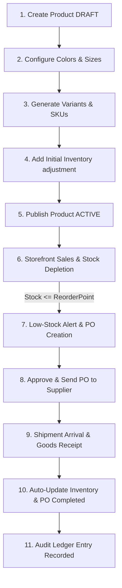

# Zenvora Platform - Advanced Inventory Lifecycle & Replenishment Guide

This document describes the end-to-end architecture, state transitions, and step-by-step lifecycle of products and inventory within the Zenvora platform. 

---

## 1. Advanced Stock Allocation Architecture

Rather than using a single static stock integer, Zenvora tracks inventory through a state-based pipeline to prevent overselling, support multi-warehouse locations, and maintain a tamper-proof audit trail.

### Core Stock Metrics

$$\text{Available Stock} = \text{Physical Stock} - \text{Committed Stock}$$

1. **Physical Stock (`physicalQty`)**: The total quantity of items physically residing in a warehouse.
2. **Committed Stock (`committedQty`)**: Quantity reserved for customer orders that have been placed but not yet shipped/fulfilled.
3. **Available Stock (`availableQty` / `stock`)**: The dynamic public stock available for sale. Customers can only view and purchase this stock.
4. **Incoming Stock (`onOrderQty`)**: Quantity ordered from suppliers via Purchase Orders but not yet delivered.

---

## 2. Product Lifecycle & Inventory Flow (Steps 1 to 11)

### Step 1: Create the Core Product
* **Description**: The administrator inputs basic information (Product Name, Description, Base Price, Category, Brand, Specifications).
* **System Action**: Creates a parent `Product` record.
* **Default Values**: `Status = DRAFT`, `For Listing = FALSE`.
* **Inventory State**: No variants, SKUs, or inventory records exist yet. The product serves purely as a metadata container.

### Step 2: Configure Product Options
* **Description**: The administrator defines options for attributes.
* **Example**: Colors (*Gold Plated*, *Silver Plated*) and Sizes (*One Size*).
* **System Action**: Creates `ProductColor` and `ProductSize` records linked to the parent product.
* **Inventory State**: Still no inventory exists.

### Step 3: Generate Product Variants
* **Description**: The administrator generates the sellable variants (combinations of options).
* **System Action**: Creates `ProductVariant` records.
  * **SKU Generation**: Generates a structured SKU using `helpers/sku-helper.ts` with the pattern: `ZV-[CATEGORY]-[STYLE_CODE]-[COLOR]-[SIZE]`.
    * *Example Gold*: `ZV-NKL-ROY9A4-GLD-OS`
    * *Example Silver*: `ZV-NKL-ROY9A4-SLV-OS`
  * **Initial Mappings**: Sets `physicalQty = 0`, `committedQty = 0`, and `onOrderQty = 0`.
  * **Warehouse Assignment**: Initializes `WarehouseStock` records with `0` quantities for every active warehouse, ensuring tracking is configured from day one.
* **Storefront Status**: Displays **Out of Stock**.

### Step 4: Add Initial Inventory
* **Description**: Once physical inventory arrives, opening stock is counted and recorded.
* **API Action**: Sends an adjustment request to `POST /api/v1/inventory/adjust` with type `MANUAL_ADJUSTMENT`.
* **System Action**: Updates the variant's `physicalQty` (and target `WarehouseStock` `physicalQty`).
* **Audit Trail**: Adds a record to the Transaction Ledger:
  * `type = MANUAL_ADJUSTMENT`
  * `qtyChange = +20`
  * `previousQty = 0`
  * `newQty = 20`
  * `reason = "Initial Stock Intake"`

### Step 5: Publish Product
* **Description**: The administrator activates the product.
* **System Action**: Sets `status = ACTIVE` and `forListing = true`.
* **Storefront Status**: Displays Available Stock dynamically. Customers can now add variants to cart and checkout.

### Step 6: Stock Depletion & Low-Stock Monitoring
* **Scenario**: Customers purchase 6 units of the Silver Plated variant (`ZV-NKL-ROY9A4-SLV-OS`), dropping available stock from `10` to `4`.
* **System Scan**: During scheduled inventory scans, the system detects:
  $$\text{Available Stock (4)} < \text{Reorder Point (5)}$$
* **System Action**: Flags the variant as **Low Stock**, adds it to the Restock Dashboard, and triggers notifications.

### Step 7: Purchase Order (PO) Creation
* **Description**: The Store Manager starts a replenishment order.
* **System Action**: Creates a `PurchaseOrder` in `DRAFT` status containing:
  * Supplier profile details.
  * Variant SKU details.
  * Quantity Ordered (*e.g., 50 Units*).
  * Unit Cost (*e.g., ₹2,500/unit*).

### Step 8: Purchase Order Approval
* **Description**: The manager reviews and clicks **Approve & Send**.
* **System Action**: 
  1. PO status updates to `SENT`.
  2. Generates a PO Quote PDF and emails it to the supplier.
  3. Variant `onOrderQty` increments by `50` in the database.
* **Inventory State**: `Incoming Stock = 50`. The stock is marked as expected but not yet saleable.

### Step 9: Goods Receipt & Delivery Check-In
* **Description**: The shipment arrives at the warehouse, and staff verify the contents against the PO.
* **Admin Action**: Navigates to the PO in the dashboard and clicks **Receive Delivery / Receive Items** specifying received quantities.

### Step 10: Automatic Inventory Update
* **API Action**: Calls `POST /api/v1/inventory/purchase-orders/:id/receive`.
* **System Action**: Inside a database transaction, updates the values:
  * Variant `physicalQty` increases by received amount (e.g. `+50`).
  * Variant `onOrderQty` decreases by received amount (e.g. `-50`).
  * PO status updates to `RECEIVED` (fully delivered) or `PARTIALLY_RECEIVED`.
* **Storefront Status**: Dynamically reflects new Available Stock immediately.

### Step 11: Inventory Ledger Recording
* **System Action**: Writes an `InventoryTransaction` audit record:
  * `type = REPLENISHMENT`
  * `qtyChange = +50`
  * `previousQty = 4`
  * `newQty = 54`
  * `reason = "Replenishment from Purchase Order [PO Number]"`
  * `poId = [PO ID]`
  * `userId = [Staff User ID]`

---

## 3. Database Schema Models (Prisma)

The relations supporting this lifecycle are mapped in `schema.prisma`:

* **`ProductVariant`**: Tracks `physicalQty`, `committedQty`, `onOrderQty`, `reorderPoint`, and `preferredReorderQty`.
* **`WarehouseStock`**: Links variant quantities (`physicalQty`, `committedQty`) to specific physical locations (`Warehouse`).
* **`InventoryTransaction`**: A read-only historical ledger storing changes (`qtyChange`, `previousQty`, `newQty`, `type`, `reason`, `userId`, `orderId`, `poId`).
* **`PurchaseOrder`**: Tracks PO metadata, supplier, dates, total cost, and status transitions (`DRAFT` -> `SENT` -> `PARTIALLY_RECEIVED` -> `RECEIVED`).
* **`PurchaseOrderItem`**: Stores ordered and received quantities per-variant.
* **`Supplier`**: Holds vendor profiles, contact information, and active statuses.
