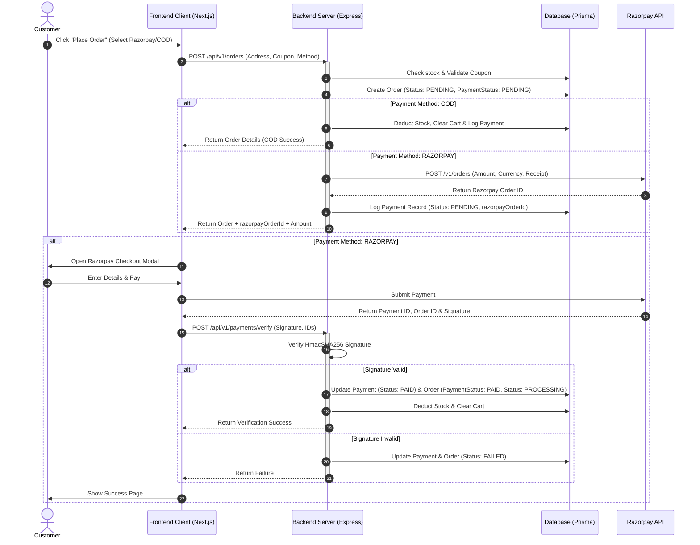

# Guide - Implementing Orders & Payments Module

This guide outlines the end-to-end architecture, database mapping, backend implementation, and frontend flows needed to complete the **Orders and Payments** modules for ZenVora E-commerce.

---

## 1. High-Level Architecture Flow



---

## 2. Database Mapping

Based on [schema.prisma](file:///c:/Users/abhis/Desktop/cbs-ecommerce/server/prisma/schema.prisma), here are the key relations:

- **Order**: Holds user details, final pricing columns (`subtotalAmount`, `shippingAmount`, `taxAmount`, `discountAmount`, `totalAmount`), tracking details, shipping address, and statuses (`status: OrderStatus`, `paymentStatus: PaymentStatus`).
- **OrderItem**: Snapshots of the products purchased at that moment (`name`, `sku`, `image`, `quantity`, `unitPrice`, `totalPrice`). Relates to `Order`, `Product`, and `ProductVariant`.
- **Payment**: Records transaction logs, mapping the `orderId` to the gateway providers (`RAZORPAY`, `COD`), methods, and status histories (timestamps for `paidAt`, `failedAt`, `refundedAt`).

---

## 3. Backend Implementation Steps

### Step 3.1: Define Schemas (`order.schema.ts`)
Create Zod schemas in `server/src/modules/orders/order.schema.ts` to validate checkout requests.

```typescript
import z from "zod";

export const createOrderSchema = z.object({
  fullName: z.string().min(2, "Full name is required"),
  phoneNumber: z.string().min(10, "Phone number is required"),
  addressLine1: z.string().min(3, "Address line 1 is required"),
  addressLine2: z.string().optional(),
  landmark: z.string().optional(),
  city: z.string().min(2, "City is required"),
  state: z.string().min(2, "State is required"),
  postalCode: z.string().min(6, "Postal code must be 6 digits"),
  country: z.string().min(2, "Country is required"),
  
  paymentMethod: z.enum(["CARD", "UPI", "NETBANKING", "WALLET", "EMI", "COD"]),
  paymentProvider: z.enum(["RAZORPAY", "COD"]),
  couponCode: z.string().optional(),
});

export const updateOrderStatusSchema = z.object({
  status: z.enum([
    "PENDING",
    "PROCESSING",
    "SHIPPED",
    "DELIVERED",
    "CANCELLED",
    "ON_HOLD",
    "PARTIALLY_SHIPPED",
    "RETURNED",
    "FAILED",
  ]),
  trackingNumber: z.string().optional(),
});

export const verifyPaymentSchema = z.object({
  orderId: z.string(),
  razorpayOrderId: z.string(),
  razorpayPaymentId: z.string(),
  razorpaySignature: z.string(),
});
```

### Step 3.2: Implement Repository Database Transactions (`order.repository.ts`)
Modify `server/src/modules/orders/order.repository.ts` to manage order insertion, stock deduction, and payment creation inside a Prisma transaction.

```typescript
import { prisma } from "../../lib/prisma.js";
import { OrderStatus, PaymentStatus } from "../../generated/prisma/client.js";

class OrderRepository {
  // Generate a unique human-readable order number (e.g. ZV-2026-XXXXXX)
  generateOrderNumber() {
    const timestamp = Date.now().toString().slice(-6);
    const random = Math.floor(100 + Math.random() * 900);
    return `ZV-${new Date().getFullYear()}-${timestamp}${random}`;
  }

  async createOrderWithTransaction(userId: string, orderData: any, cartItems: any[], discountInfo: any) {
    return prisma.$transaction(async (tx) => {
      // 1. Create the Order
      const orderNumber = this.generateOrderNumber();
      const order = await tx.order.create({
        data: {
          orderNumber,
          userId,
          fullName: orderData.fullName,
          phoneNumber: orderData.phoneNumber,
          addressLine1: orderData.addressLine1,
          addressLine2: orderData.addressLine2 || null,
          landmark: orderData.landmark || null,
          city: orderData.city,
          state: orderData.state,
          postalCode: orderData.postalCode,
          country: orderData.country,
          subtotalAmount: orderData.subtotal,
          shippingAmount: orderData.shipping,
          taxAmount: orderData.tax,
          discountAmount: discountInfo.amount,
          totalAmount: orderData.total,
          status: orderData.paymentProvider === "COD" ? "PROCESSING" : "PENDING",
          paymentStatus: "PENDING",
        },
      });

      // 2. Create Order Items
      const orderItemsData = cartItems.map((item) => ({
        orderId: order.id,
        productId: item.variant.productId,
        variantId: item.variantId,
        name: item.variant.product.name,
        sku: item.variant.sku,
        image: item.variant.product.images[0]?.media?.url || "",
        quantity: item.quantity,
        unitPrice: item.variant.price || item.variant.product.price,
        totalPrice: (item.variant.price || item.variant.product.price) * item.quantity,
      }));

      await tx.orderItem.createMany({ data: orderItemsData });

      // 3. Create initial Payment record
      const payment = await tx.payment.create({
        data: {
          orderId: order.id,
          provider: orderData.paymentProvider,
          method: orderData.paymentMethod,
          status: "PENDING",
          amount: orderData.total,
          currency: "INR",
        },
      });

      // 4. If COD, deduct stock & clear cart immediately
      if (orderData.paymentProvider === "COD") {
        for (const item of cartItems) {
          await tx.productVariant.update({
            where: { id: item.variantId },
            data: { stock: { decrement: item.quantity } },
          });
        }
        await tx.cartItem.deleteMany({ where: { cartId: orderData.cartId } });
      }

      return { order, payment };
    });
  }
}
```

### Step 3.3: Razorpay Service Integration
Create a payment utility/service `server/src/modules/payments/razorpay.service.ts`.

> [!TIP]
> Use `crypto` for verifying Razorpay signatures. The signature formula is:
> `HMAC-SHA256(razorpay_order_id + "|" + razorpay_payment_id, secret)`

```typescript
import crypto from "crypto";

export class RazorpayService {
  // Create an order on Razorpay
  static async createRazorpayOrder(amount: number, receiptId: string) {
    const keyId = process.env.RAZORPAY_KEY_ID;
    const keySecret = process.env.RAZORPAY_KEY_SECRET;
    
    // Amount must be in paise (e.g. 500 INR = 50000 paise)
    const payload = {
      amount: Math.round(amount * 100),
      currency: "INR",
      receipt: receiptId,
    };

    const response = await fetch("https://api.razorpay.com/v1/orders", {
      method: "POST",
      headers: {
        "Content-Type": "application/json",
        Authorization: "Basic " + Buffer.from(`${keyId}:${keySecret}`).toString("base64"),
      },
      body: JSON.stringify(payload),
    });

    if (!response.ok) {
      throw new Error("Failed to create Razorpay order");
    }

    return response.json();
  }

  // Verify Razorpay callback signature
  static verifySignature(orderId: string, paymentId: string, signature: string) {
    const keySecret = process.env.RAZORPAY_KEY_SECRET || "";
    const generated = crypto
      .createHmac("sha256", keySecret)
      .update(`${orderId}|${paymentId}`)
      .digest("hex");
      
    return generated === signature;
  }
}
```

### Step 3.4: Payment Verification API Handler
When Razorpay successfully charges a card, the client will POST details to `POST /api/v1/payments/verify`. Verify and finalize the order inside a database transaction:

```typescript
async verifyPayment(req: Request, res: Response) {
  const { orderId, razorpayOrderId, razorpayPaymentId, razorpaySignature } = verifyPaymentSchema.parse(req.body);

  const isValid = RazorpayService.verifySignature(razorpayOrderId, razorpayPaymentId, razorpaySignature);
  if (!isValid) {
    return res.status(400).json({ success: false, message: "Invalid payment signature" });
  }

  await prisma.$transaction(async (tx) => {
    // 1. Update Payment status to PAID
    await tx.payment.updateMany({
      where: { orderId, provider: "RAZORPAY" },
      data: {
        status: "PAID",
        razorpayOrderId,
        razorpayPaymentId,
        razorpaySignature,
        paidAt: new Date(),
        capturedAt: new Date(),
      },
    });

    // 2. Update Order status
    const order = await tx.order.update({
      where: { id: orderId },
      data: {
        paymentStatus: "PAID",
        status: "PROCESSING",
      },
      include: {
        orderItems: true,
      },
    });

    // 3. Deduct Inventory Stock
    for (const item of order.orderItems) {
      if (item.variantId) {
        await tx.productVariant.update({
          where: { id: item.variantId },
          data: { stock: { decrement: item.quantity } },
        });
      }
    }

    // 4. Clear Customer's Cart
    const cart = await tx.cart.findUnique({ where: { userId: order.userId } });
    if (cart) {
      await tx.cartItem.deleteMany({ where: { cartId: cart.id } });
    }
  });

  return res.status(200).json({ success: true, message: "Payment verified & order processed" });
}
```

---

## 4. Frontend Integration

### Step 4.1: Inject Razorpay SDK Checkout
Include Razorpay's CDN script inside the client layout or dynamically load it on checkout initialization.

```typescript
const loadRazorpayScript = () => {
  return new Promise((resolve) => {
    const script = document.createElement("script");
    script.src = "https://checkout.razorpay.com/v1/checkout.js";
    script.onload = () => resolve(true);
    script.onerror = () => resolve(false);
    document.body.appendChild(script);
  });
};
```

### Step 4.2: Frontend Razorpay Checkout Handler
When the backend returns a successful Razorpay order response, open the checkout dialog:

```typescript
const handleRazorpayPayment = async (orderData: any, razorpayData: any) => {
  const isLoaded = await loadRazorpayScript();
  if (!isLoaded) {
    alert("Razorpay SDK failed to load. Please check your internet connection.");
    return;
  }

  const options = {
    key: process.env.NEXT_PUBLIC_RAZORPAY_KEY_ID, // Enter Key ID
    amount: razorpayData.amount, // in paise
    currency: "INR",
    name: "ZenVora Store",
    description: `Payment for Order #${orderData.orderNumber}`,
    order_id: razorpayData.id, // Razorpay Order ID
    handler: async function (response: any) {
      // payment succeeded! Trigger backend verification callback
      const verificationResponse = await verifyPaymentMutation({
        orderId: orderData.id,
        razorpayOrderId: response.razorpay_order_id,
        razorpayPaymentId: response.razorpay_payment_id,
        razorpaySignature: response.razorpay_signature,
      }).unwrap();
      
      if (verificationResponse.success) {
        // Redirect to Order success page
        window.location.href = `/checkout/success?orderId=${orderData.id}`;
      }
    },
    prefill: {
      name: orderData.fullName,
      contact: orderData.phoneNumber,
    },
    theme: {
      color: "#f5f5f4", // matches stone-50 light background styling
    },
  };

  const paymentObject = new (window as any).Razorpay(options);
  paymentObject.open();
};
```

---

## 5. Dashboard Views Design Guidelines

Ensure your order and transaction views follow ZenVora’s HSL tailormade palettes:

1. **Dashboard Orders Panel (`client/src/app/dashboard/orders/page.tsx`)**:
   - Render a Table displaying `orderNumber`, `fullName`, `totalAmount`, `paymentStatus` (styled with soft Badges: Emerald for Paid, Amber for Pending, Rose for Failed), and shipping `status`.
   - Implement an action button to "Update Shipping Status" that displays a dialog with a dropdown selector changing order status (`PROCESSING` -> `SHIPPED` -> `DELIVERED`). Add an input for `trackingNumber` once shipped.
   - Include filter bars to search by Order ID or filter by Status.

2. **Dashboard Payments Audit Panel (`client/src/app/dashboard/payments/page.tsx`)**:
   - Render a transactional audit log listing payment IDs, gateway providers, payment methods, raw transaction IDs (like `razorpayPaymentId`), and timestamps.
   - Display a visual chart (using Recharts Area or Line charts) representing transaction volumes over time.
